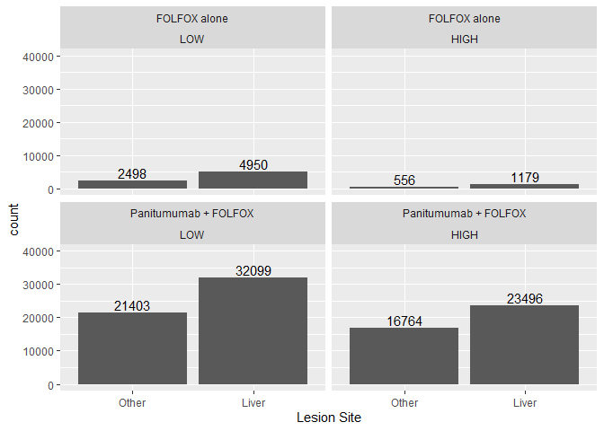
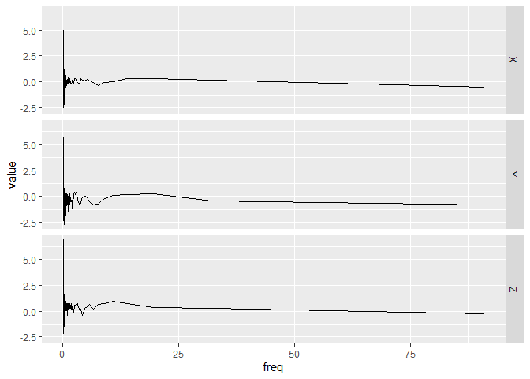
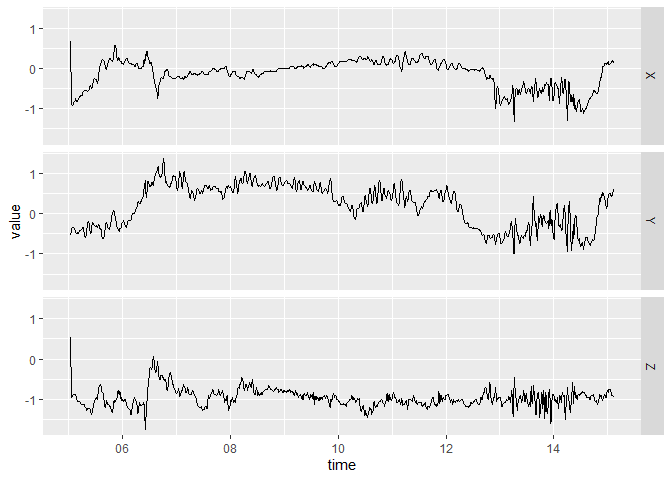

<!-- README.md is generated from README.Rmd. Please edit that file -->

# bis620.2022

<!-- badges: start -->

[](https://github.com/JadenWSR/bis620.2022/actions/workflows/R-CMD-check.yaml)
[](https://github.com/JadenWSR/bis620.2022/actions/workflows/test-coverage.yaml)
[](https://github.com/JadenWSR/bis620.2022/actions/workflows/lint.yaml)
[](https://codecov.io/gh/JadenWSR/bis620.2022)
<!-- badges: end -->

**Final Project**  
The goal of bis620.2022 is to provide functions for the users to acquire
and preprocess the panitumumab lesion data, make a side-by-side
facet-wrapped bar plot, and perform logistic regression analysis on the
data to answer the research question.

**Research Question**  
We hypothesized that **a patient in the study who has a higher level of
“Skin and subcutaneous tissue disorders” adverse effect would have a
higher chance of getting new lesions during the treatment.**

**Homework 3**  
The goal of bis620.2022 is to provide functions for the users to acquire
UKBiobank accelerometry data, get the spectral signature for the data
with three dimensions using Fast Fourier Transform (FFT) and visualize
the resulting times-series/frequency data.

## Installation

You can install the development version of bis620.2022 from
[GitHub](https://github.com/) with:

``` r
# install.packages("devtools")
devtools::install_github("JadenWSR/bis620.2022")
```

## Examples Final Project

``` r
library(bis620.2022)
```

### Get the panitumumab lesion data

``` r
data(lesion)
head(lesion)
#> # A tibble: 6 × 30
#>   SUBJID AESEVCD VISITDY VISIT    LSCAT LSNEW LSSLD  LSLD LSSITE LSNEW…¹ LSREA…²
#>   <chr>    <dbl>   <dbl> <chr>    <chr> <chr> <dbl> <dbl> <chr>  <chr>   <chr>  
#> 1 000003       1     -11 Screeni… Targ… N       118    39 Liver  N       Radiol…
#> 2 000003       1     -11 Screeni… Targ… N        65    35 Liver  N       Radiol…
#> 3 000003       1     -11 Screeni… Targ… N       118    28 Liver  N       Radiol…
#> 4 000003       1     -11 Screeni… Targ… N        65    30 Liver  N       Radiol…
#> 5 000003       1     -11 Screeni… Targ… N       118    51 Other  N       Radiol…
#> 6 000003       1     -11 Screeni… Non-… N        NA    NA Lymph… N       Radiol…
#> # … with 19 more variables: LSTYPE <chr>, TRT <chr>, ATRT <chr>, PRSURG <chr>,
#> #   DTHDY <dbl>, DTH <dbl>, PFSDYCR <dbl>, PFSCR <dbl>, LIVERMET <chr>,
#> #   DIAGMONS <dbl>, AGE <dbl>, SEX <chr>, B_WEIGHT <dbl>, B_HEIGHT <dbl>,
#> #   RACE <chr>, B_ECOG <chr>, HISSUBTY <chr>, B_METANM <dbl>, DIAGTYPE <chr>,
#> #   and abbreviated variable names ¹​LSNEWANY, ²​LSREADER
```

### Preprocess the Panitumumab lesion data

``` r
liver <- data_processing(lesion, "Liver")
# Check newly added columns
print(head(liver$new_ls))
#> [1] Liver Liver Liver Liver Other Other
#> Levels: Other Liver
print(head(liver$level))
#> [1] LOW LOW LOW LOW LOW LOW
#> Levels: LOW HIGH
```

### Make a side-by-side facet-wrapped bar plot

``` r
plot_lesion(lesion, "Liver")
```



### Perform Analysis

``` r
logit_analysis(lesion, "Liver")
#> [1] "The lesion site you chosed is Liver."
#> 
#> Call:
#> glm(formula = new_ls ~ level * ATRT, family = "binomial", data = df)
#> 
#> Deviance Residuals: 
#>    Min      1Q  Median      3Q     Max  
#> -1.509  -1.324   1.011   1.011   1.038  
#> 
#> Coefficients:
#>                                    Estimate Std. Error z value Pr(>|z|)    
#> (Intercept)                         0.68390    0.02454  27.866   <2e-16 ***
#> levelHIGH                           0.06776    0.05700   1.189   0.2346    
#> ATRTPanitumumab + FOLFOX           -0.27860    0.02608 -10.682   <2e-16 ***
#> levelHIGH:ATRTPanitumumab + FOLFOX -0.13545    0.05856  -2.313   0.0207 *  
#> ---
#> Signif. codes:  0 '***' 0.001 '**' 0.01 '*' 0.05 '.' 0.1 ' ' 1
#> 
#> (Dispersion parameter for binomial family taken to be 1)
#> 
#>     Null deviance: 138601  on 102944  degrees of freedom
#> Residual deviance: 138377  on 102941  degrees of freedom
#> AIC: 138385
#> 
#> Number of Fisher Scoring iterations: 4
```



## Examples Homework 3

### Get UKBiobank accelerometry data

``` r
data(ukb_accel)
head(ukb_accel)
#> # A tibble: 6 × 4
#>   time                     X      Y      Z
#>   <dttm>               <dbl>  <dbl>  <dbl>
#> 1 2017-03-13 10:00:05  0.672 -0.531  0.547
#> 2 2017-03-13 10:00:05 -0.844 -0.406 -0.922
#> 3 2017-03-13 10:00:05 -0.891 -0.391 -0.953
#> 4 2017-03-13 10:00:05 -0.906 -0.344 -0.938
#> 5 2017-03-13 10:00:05 -0.906 -0.328 -0.922
#> 6 2017-03-13 10:00:05 -0.891 -0.344 -0.891
```

### accel_plot()

This function plots UKBiobank accelerometry data.

``` r
accel_plot(ukb_accel[1:1000,])
```



### spectral_signature()

This function is used to get the Spectral Signature of Accelerometry
Data. The spectral signature is calculated by taking the modulus of the
Fourier coefficients of the signal.

``` r
ukb_accel[1:1000,] |> spectral_signature(take_log = T)
#> # A tibble: 500 × 4
#>        X     Y     Z   freq
#>    <dbl> <dbl> <dbl>  <dbl>
#>  1  4.84  5.37  6.87 0.0993
#>  2  4.97  5.67  4.02 0.0995
#>  3  4.82  4.16  3.51 0.0997
#>  4  3.75  4.01  2.20 0.0999
#>  5  2.91  4.66  3.60 0.100 
#>  6  3.82  3.19  3.89 0.100 
#>  7  3.07  4.10  3.54 0.100 
#>  8  3.28  4.28  3.35 0.101 
#>  9  3.80  2.78  2.97 0.101 
#> 10  3.85  3.24  3.14 0.101 
#> # … with 490 more rows
```

``` r
ukb_accel[1:1000,] |> spectral_signature(take_log = T) |> accel_plot()
```


