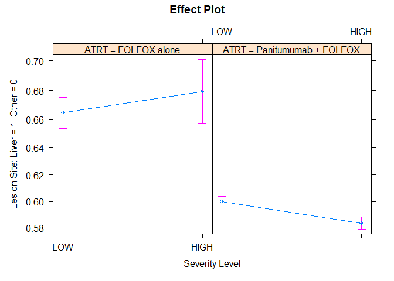

<!-- README.md is generated from README.Rmd. Please edit that file -->

# bis620.2022

<!-- badges: start -->

[](https://github.com/JadenWSR/bis620.2022/actions/workflows/R-CMD-check.yaml)
[](https://github.com/JadenWSR/bis620.2022/actions/workflows/test-coverage.yaml)
[](https://github.com/JadenWSR/bis620.2022/actions/workflows/lint.yaml)
[](https://codecov.io/gh/JadenWSR/bis620.2022)
<!-- badges: end -->

The goal of bis620.2022 is to provide functions for the users to acquire
UKBiobank accelerometry data, get the spectral signature for the data
with three dimensions using Fast Fourier Transform (FFT) and visualize
the resulting times-series/frequency data.

## Installation

You can install the development version of bis620.2022 from
[GitHub](https://github.com/) with:

``` r
# install.packages("devtools")
devtools::install_github("JadenWSR/bis620.2022")
```

## Examples

``` r
library(bis620.2022)
```

### Get UKBiobank accelerometry data

``` r
data(ukb_accel)
head(ukb_accel)
#> # A tibble: 6 × 4
#>   time                     X      Y      Z
#>   <dttm>               <dbl>  <dbl>  <dbl>
#> 1 2017-03-13 10:00:05  0.672 -0.531  0.547
#> 2 2017-03-13 10:00:05 -0.844 -0.406 -0.922
#> 3 2017-03-13 10:00:05 -0.891 -0.391 -0.953
#> 4 2017-03-13 10:00:05 -0.906 -0.344 -0.938
#> 5 2017-03-13 10:00:05 -0.906 -0.328 -0.922
#> 6 2017-03-13 10:00:05 -0.891 -0.344 -0.891
```

### accel_plot()

This function plots UKBiobank accelerometry data.

``` r
accel_plot(ukb_accel[1:1000,])
```


### spectral_signature()

This function is used to get the Spectral Signature of Accelerometry
Data. The spectral signature is calculated by taking the modulus of the
Fourier coefficients of the signal.

``` r
ukb_accel[1:1000,] |> spectral_signature(take_log = T)
#> # A tibble: 500 × 4
#>        X     Y     Z   freq
#>    <dbl> <dbl> <dbl>  <dbl>
#>  1  4.84  5.37  6.87 0.0993
#>  2  4.97  5.67  4.02 0.0995
#>  3  4.82  4.16  3.51 0.0997
#>  4  3.75  4.01  2.20 0.0999
#>  5  2.91  4.66  3.60 0.100 
#>  6  3.82  3.19  3.89 0.100 
#>  7  3.07  4.10  3.54 0.100 
#>  8  3.28  4.28  3.35 0.101 
#>  9  3.80  2.78  2.97 0.101 
#> 10  3.85  3.24  3.14 0.101 
#> # … with 490 more rows
```

``` r
ukb_accel[1:1000,] |> spectral_signature(take_log = T) |> accel_plot()
```


